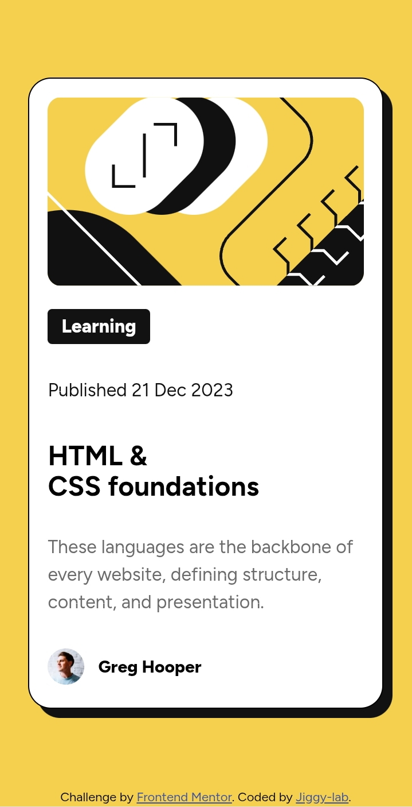

# Frontend Mentor - Blog preview card solution

This is a solution to the [Blog preview card challenge on Frontend Mentor](https://www.frontendmentor.io/challenges/blog-preview-card-ckP9_QC665). 

## Table of contents

- [Overview](#overview)
  - [The challenge](#the-challenge)
  - [Screenshot](#screenshot)
  - [Links](#links)
- [My process](#my-process)
  - [Built with](#built-with)
  - [What I learned](#what-i-learned)
  - [Development Notes](#development-notes)
- [Author](#author)

## Overview

### The challenge

Users should be able to:

- See hover and focus states for all interactive elements on the page
- View the optimal layout depending on their device's screen size

### Screenshot 


### Links

- Solution URL: [https://github.com/jiggy-lab/Blog-preview-card-.git]
- Live Site URL: [https://jiggy-lab.github.io/Blog-preview-card-/]

## My process

### Built with

- Semantic HTML5 markup
- CSS custom properties (Variables)
- Flexbox
- Mobile-first workflow
- **Coded entirely on a mobile device** 📱

### What I learned

This project helped me master Flexbox alignment and handling responsive issues on mobile browsers.

The most challenging part was fixing the layout when the phone is rotated to landscape mode. I solved this by using `flex-grow: 1` on the main container and `min-height: 100dvh` on the body to handle dynamic browser toolbars.

### Development notes
Coding this on a smartphone was a unique challenge! I enjoyed it cos of its portability.

### Author

- Frontend Mentor - [@jiggy-lab](https://www.frontendmentor.io/profile/jiggy-lab)
- GitHub - [jiggy-lab](https://github.com/jiggy-lab)

```css
/* My favorite snippet from this project */
body {
  min-height: 100dvh;
  display: flex;
  flex-direction: column;
}
